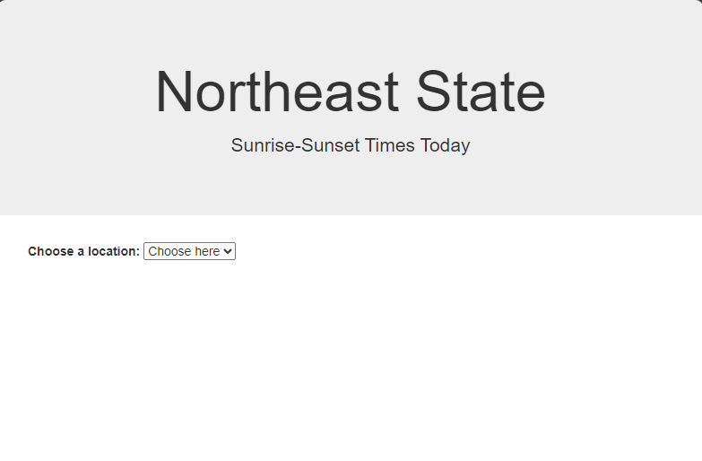
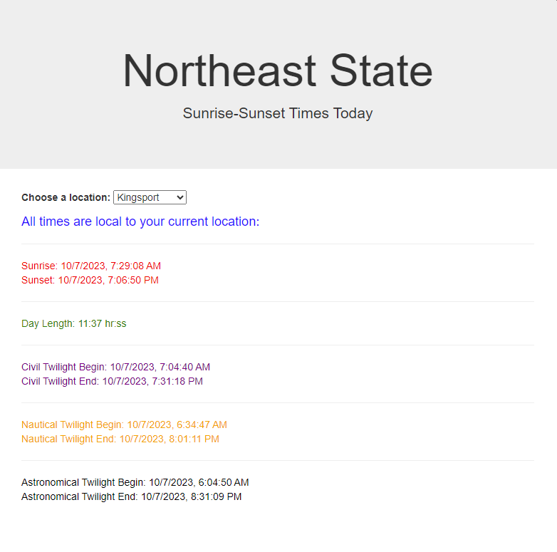

# Project - Sunrise-Sunset

## Instructions

-   Add the this project to a local Git repo. Track your changes. Create a dev branch and merge the main and dev branch before turning in the project.

-   For this project you will create a webpage that allows the user to select one out of four (4) locations. After the user selects a location the javascript will call the API: https://api.sunrise-sunset.org.

-   Go to the site and learn how their API works. You will need to understand how to form the endpoint. Use `formatted=0` as one of the endpoint parameters.

-   This API does not require a key to access it. After selecting a city, a change eventlistener is fired which calls an AJAX funtion sending it the Longitude and Latitude for that city. 

-   These values are hard-coded into your javascript instead of looking them up with another API call (geolocation). You may add other locations if you desire. 

-   Then you will process the json returned from the sunrise-sunset API call and show the times for all information as a local time.

-   Add a little color (style) to your output so it is easy to see the different data points.

Here are a couple of screen-shots of what the solution should look like:

I have included the html file that you should use. You do not need to change anything in this file.

I have included the javascript file that you will use. You will need to complete the `TODO` sections so it will work properly.

Also include a readme.md file that explains what you did to solve the problem. List the API endpoint you used along with the output data points that were returned from the API call.

Below are some code snippets that will be useful in solving the problem:

## Deliverables

Zip up the folder with both the html and js files in it. Also add a readme.md file that tells what you did to solve the problem.